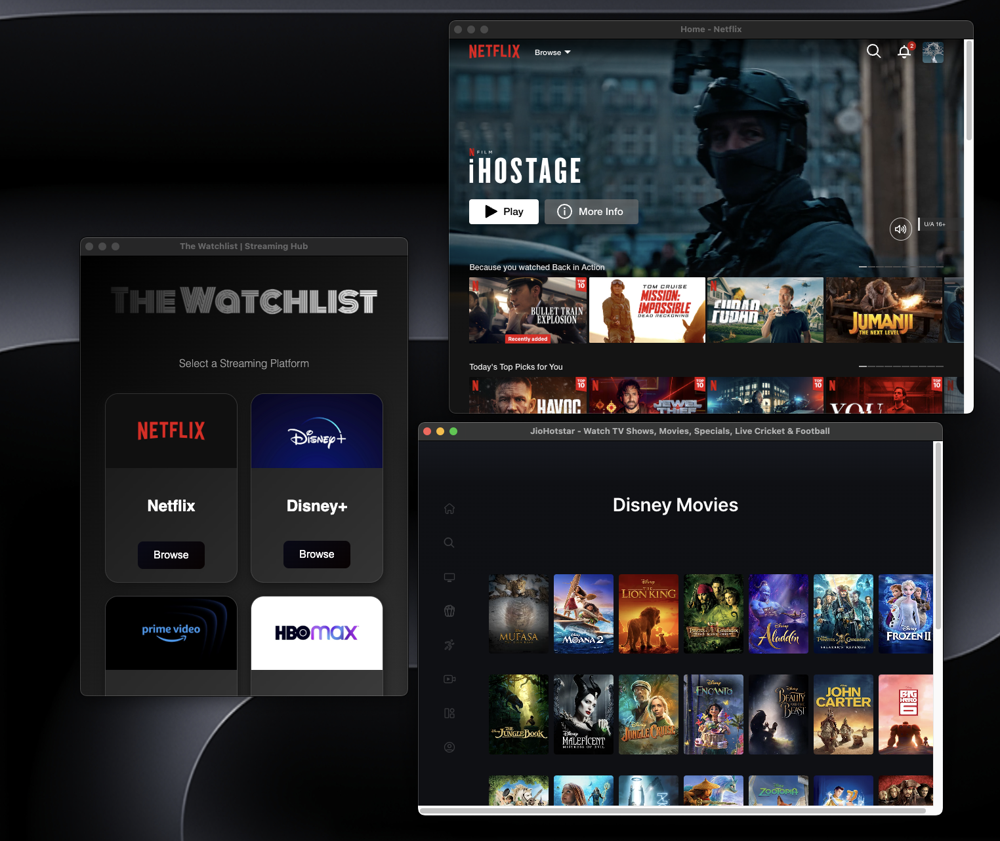

# **The Watchlist** 🎬

**Streaming Hub** is a desktop app created just for fun to consolidate your favorite streaming platforms in one place. No more opening individual websites to continue watching your shows. Just launch the app and pick up where you left off—easy and quick!

---



## **About** 📺

This project is an **exploration** into using Electron to build a simple desktop app that brings together all the popular streaming services. It’s a fun little side project, but it might help someone who’s tired of opening multiple tabs for different platforms.

- **Centralized Access**: Quickly open Netflix, Hulu, Disney+, Prime Video, and more—all from one app.
- **Simple Interface**: Minimal design to focus on what matters—watching your favorite content.
- **Cross-Platform**: Works on Windows, macOS, and Linux.
- **For Fun**: Built as an exploration project, but it could solve a real problem for some users.

---

## **How to Use** 🖥️

1. **Install the app**: Download the latest version or build it yourself from the repo.
2. **Launch the app**: Open it and see your favorite streaming platforms ready to go.
3. **Enjoy**: One-click access to your streaming platforms—no more endless tabs!

---

## **Installation** ⚙️

1. **Clone the repo**:

   ```bash
   git clone https://github.com/yourusername/streaming-hub.git
   cd streaming-hub
   ```

2. **Install dependencies**:

   ```bash
   pnpm install
   ```

   After installing dependencies, run 👇🏻

   ```bash
   node node_modules/electron/install.js
   ```

3. **Run the app**:

   ```bash
   pnpm dev
   ```

   To build the app locally, run:

   ```bash
   pnpm run package
   ```

---

## **Technologies Used** 🛠️

- **Electron**: For packaging the app as a desktop application.
- **React**: For the user interface.
- **Webpack**: For bundling the app.
- **CSS**: For styling.

---

## **License** 📄

This project is open-source and available under the [MIT License](LICENSE).

---

Enjoy seamless access to your favorite streaming services with **The Watchlist**! 🎉

---
